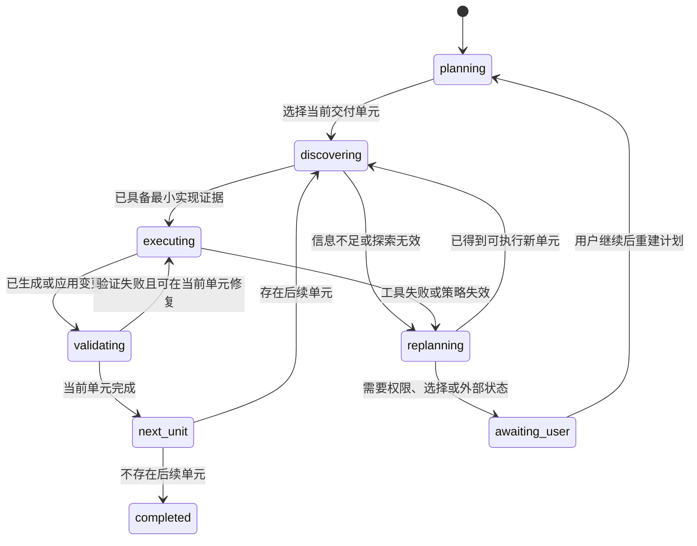

# 通用智能体渐进交付与恢复运行时改造计划

## 1. 文档目的

本文为 `web-ide` 的通用智能体运行时提供可实施的改造路线。目标是让智能体面对大型、多文件、跨模块或不确定性较高的任务时，能够将任务拆解为可验证的小批次持续交付；在探索受阻、工具失败或上下文压力过高时，重规划、暂停等待决策或保留可继续状态，而不是把一次局部策略失败直接升级为整个任务失败。

本文是工程设计与实施说明，不是某个业务任务的操作手册。文中所有概念均为通用能力，**不得**在 Runtime、提示词、测试或前端状态中加入特定框架、语言、目录名、页面类型或业务关键词的特殊分支。

## 2. 背景与问题证据

### 2.1 当前运行时能力

现有系统已经具备改造所需的大部分基础设施：

- `agentRuntime.ts`：模型循环、工具执行、重复调用拦截、预算收敛与无进展保护；
- `taskPlanService.ts` 和 `taskWorkflow/*`：任务计划、工作流分类与计划审批；
- `contextSelection/*` 与 `contextBudget/*`：候选上下文选择、上下文压缩和结构化摘要；
- `taskSessionStore.ts`：任务会话、计划、步骤、检查点与运行态持久化；
- `checkpointStore.ts`：已应用修改的检查点；
- `observability/runMetrics.ts` 与 `observability/taskMetrics.ts`：运行指标和任务级指标；
- Web 端 `TaskPlanPanel.tsx` 与 `AgentStepsPanel.tsx`：计划、运行状态和步骤轨迹展示。

因此本次改造应以编排和状态语义重构为主，优先复用现有能力，不引入新的 Agent 框架或第三方依赖。

### 2.2 已观察到的问题

最近一次大型代码转换任务的运行指标显示：任务读取了多个源文件并产生了大量上下文，但在生成补丁之前进入了无进展停止状态；该运行没有生成补丁、没有应用文件变更，也没有执行验证。任务级指标还显示较高的上下文压缩次数和多个失败工具调用，但没有记录失败调用的完整链路。

这不是某个技术栈转换本身的失败，而是通用运行时的以下缺口：

1. 当前“连续无进展”主要是终止保护，缺少可交付批次完成后的自然收敛路径。
2. 计划存在，但没有成为 Runtime 强制消费的“当前交付单元”。模型可以读完大量候选文件后继续探索。
3. 工具失败只提供聚合计数，无法回答“哪个工具、以什么参数、在什么上下文下失败、Runtime 采取了什么动作”。
4. 上下文压缩发生后，缺少将工作明确转交到下一批次、下一会话或用户决策的机制。
5. 前端能展示计划和步骤，但无法把“可恢复的暂停”与“不可恢复的失败”清晰区分，也没有明确的继续入口。

### 2.3 当前停止逻辑的局限

`agentRuntime.ts` 在连续无进展调用达到阈值后会执行有限次数的策略恢复，恢复无效则返回 `no_progress`。默认阈值由 `AI_AGENT_MAX_NO_PROGRESS_STEPS` 和 `AI_AGENT_RECOVERY_ATTEMPTS` 控制。

该保护仍然必要：它可以防止模型无限重复搜索、读取或提交相同工具调用。但是它不应单独决定任务最终命运。对于一个仍有待完成计划、已发现候选文件、但暂未形成补丁的任务，正确结果通常是“需要重规划”或“等待决策”，而非“任务失败”。

## 3. 外部产品策略与设计取向

主流 AI IDE 的公开产品形态虽然不同，但有一致的工程取向：

- GitHub Copilot 将复杂修改拆为 Plan 与 Agent 两个阶段；计划经过审阅后再进入实施，并支持隔离上下文的子智能体处理独立问题。
- Cursor 将只读理解、自治多文件编辑与精确编辑区分为不同模式；其 Agent 修改具有可审查 diff 与可恢复 checkpoint。
- 后台智能体通常在隔离工作区中运行，支持查看进度、追加指令和人工接管。

本项目不需要复制任何产品界面或协议，但应吸收其通用原则：**计划先行、最小批次、增量验证、可恢复状态、可审计日志、人工可接管。**

## 4. 设计目标、非目标与约束

### 4.1 设计目标

1. 将复杂任务执行为一系列有边界、可验证、可恢复的交付单元。
2. 让无进展信号触发分级恢复，而不是立即导致不可恢复失败。
3. 保留严格的重复调用和预算保护，避免无限模型调用。
4. 让每次工具失败、恢复和停止具备足够的可观测性。
5. 在不影响简单任务延迟的前提下，提高大任务成功率和可继续性。
6. 允许用户在恰当时机批准计划、重规划、继续当前批次或提供缺失决策。

### 4.2 非目标

- 不实现针对任何语言、框架、目录、文件扩展名或业务术语的专项迁移器。
- 不根据用户请求中的关键词硬编码“任务大小”或“应修改哪些文件”。
- 不在本次改造中新增远程执行环境、Git worktree 管理或多智能体调度；这些可作为后续独立能力。
- 不降低 Safe Editor、命令审批、文件范围校验和验证门禁的安全要求。
- 不承诺在没有源代码、权限、依赖或用户决策的情况下自动完成任务。

### 4.3 技术约束

- 服务端：TypeScript、Node.js、Express；前端：React、Vite；包管理器：pnpm workspace。
- 不新增第三方依赖，不手动修改 `pnpm-lock.yaml`。
- 所有状态文件继续使用现有原子写入、恢复和任务会话队列机制。
- 所有新增生产代码包含必要的中文注释；测试不得请求真实模型或外部服务。
- 新能力使用 Feature Flag 灰度，默认行为必须可安全回退。

## 5. 核心概念与目标架构

### 5.1 交付单元（Delivery Unit）

交付单元是由一个或多个任务计划项组成的最小可实施范围。它不描述业务类型，而描述执行边界。每个单元至少包含：

- 稳定 ID、标题和来源计划项；
- 完成条件：生成可审查补丁、产生已应用变更、得到验证结论或明确记录阻塞原因；
- 允许读取的候选文件、已读取文件和计划修改文件；
- 依赖的前置单元；
- 当前状态：`pending`、`active`、`validated`、`blocked`、`deferred`；
- 与之关联的检查点、验证命令与恢复记录。

交付单元的生成依赖计划、上下文选择和文件影响证据，不依赖任务文本中的技术关键词。初期不要求模型额外输出复杂 DAG：可以先按现有计划步骤顺序形成单元，只有当计划或影响分析明确给出依赖时才建立依赖边。

### 5.2 运行时阶段

目标状态机如下：

`no_progress` 不再是唯一的最终状态。它是一次运行时观测，后续根据事实转化为：`awaiting_replan`、`awaiting_user`、`incomplete` 或极少数真正的 `failed`。

### 5.3 进展（Progress）判定

必须用结构化进展向量取代“工具有无返回内容”的单一判定。一次动作只要产生下列任意一种新证据，即视为进展：

- 发现并确认新的相关文件、符号、依赖关系或负面证据；
- 为当前单元建立或修订了文件计划；
- 将文件读取为可编辑上下文，且该文件未在当前单元读取过；
- 生成、应用或回滚补丁；
- 新增检查点；
- 运行了新的验证命令，或获得了新的验证结果；
- 将一个计划项或交付单元推进至更高确定性的状态；
- 形成了必须由用户处理的、具体且可回答的决策项。

相同工具签名、相同失败码、相同文件范围且没有新增上述证据时，才计入无进展。重复调用继续按当前缓存和阻断策略执行。

## 6. 分阶段实施计划

## 阶段 0：建立基线、开关与验收夹具

### 目标

在不修改 Runtime 行为的情况下，锁定当前行为、补齐可重复的离线测试夹具，并为后续灰度提供可观测基线。

### 修改内容

1. 在 `agentRuntime.test.ts` 新增受控模型脚本，复现以下通用场景：
   - 先发现多个文件、随后多次空搜索；
   - 工具失败后成功切换为补丁生成；
   - 连续无进展且没有任何可交付物；
   - 已有补丁或验证结果后发生无进展；
   - 上下文压缩后仍有待执行计划项。
2. 在 `runMetrics.ts` 和 `taskMetrics.ts` 的测试中记录现有指标口径，防止后续改动悄然改变历史字段语义。
3. 新增 Feature Flag 解析，但默认关闭新编排行为，例如 `AGENT_PROGRESSIVE_DELIVERY_ENABLED=0`。
4. 记录基线指标：无进展停止率、无补丁停止率、每任务上下文压缩次数、失败工具调用数、从停止到人工继续的次数。

### 验收

- 新增测试不访问网络、不调用真实模型、不写入真实业务工作区。
- Flag 关闭时，现有 Runtime 行为和现有测试结果不变。
- 基线用例可稳定重放并能断言任务最终状态、计划状态和关键指标。

## 阶段 1：扩展状态模型与任务会话持久化

### 目标

为交付单元、恢复决策和工具诊断建立可版本化的数据模型；先持久化，再改变执行逻辑。

### 修改内容

1. 在 `types.ts` 增加以下通用类型：
   - `DeliveryUnit`、`DeliveryUnitStatus`；
   - `ToolFailureDiagnostic`：工具名、参数摘要、错误码、错误分类、是否可重试、关联单元、时间戳；
   - `RecoveryDecision`：触发信号、候选动作、最终动作、理由、关联证据；
   - `TaskContinuation`：下一步类型、需要用户输入的字段、可自动继续条件。
2. 为 `TaskSession` 增加可选字段：`deliveryUnits`、`activeDeliveryUnitId`、`recoveryHistory`、`continuation`。历史会话缺失这些字段时必须保持兼容。
3. 在 `taskSessionStore.ts` 提供窄接口，禁止 Runtime 直接拼接或整体覆盖会话对象：
   - 设置/更新当前单元；
   - 追加工具诊断；
   - 追加恢复决策；
   - 写入或清除继续建议；
   - 将计划项和单元状态双向同步。
4. 在 `routeAgentSteps.ts` 扩展步骤事件：`delivery_unit_started`、`delivery_unit_completed`、`replan_requested`、`awaiting_user_decision`、`tool_failure_recorded`。每个事件都必须带可显示的中文说明和结构化详情。

### 关键约束

- 不持久化完整源代码、完整 Prompt、密钥或完整命令输出；工具参数和错误文本必须沿用现有脱敏与截断规则。
- 状态更新继续走现有队列和原子写入逻辑。
- 单元状态不能越过验证或审批门禁直接标为完成。

### 验收

- 旧任务会话能够正常读取和显示。
- 并发更新不会丢失诊断、计划项或检查点。
- 任务重启后可恢复当前单元与继续建议。

## 阶段 2：从任务计划生成交付单元

### 目标

让计划成为 Runtime 可消费的执行边界，而不是仅供 UI 展示的 Todo 列表。

### 修改内容

1. 在 `taskPlanService.ts` 增加纯函数，将 `TaskPlanItem[]` 和工作流快照转换为 `DeliveryUnit[]`：
   - 初始实现按工作流顺序生成单元；
   - 可合并明确属于同一原子变更的相邻计划项；
   - 只有已有影响分析或计划证据表明存在依赖时，才记录依赖关系；
   - 对信息不足的单元保留 `pending`，不猜测文件范围。
2. 在初始化计划、用户重写计划、验证失败重规划时，同步生成或修订单元。
3. 将当前活跃单元的候选文件范围传入 `contextSelection`；上下文选择只服务于当前单元，历史单元仅提供摘要。
4. 为每个单元定义通用完成条件：
   - 变更型单元：至少有待审补丁或已应用文件变更；
   - 验证型单元：至少有对应命令结果；
   - 分析型单元：至少有结构化结论或明确阻塞项。

### 关键约束

- 不以计划标题文本决定单元类型；应使用已有工作流类型、工具证据与计划项状态。
- 不把“所有候选文件”自动视为当前单元范围。
- 用户调整计划后，已完成单元不能被无条件重置；必须记录计划修订原因。

### 验收

- 单计划项任务只生成一个单元，不增加额外延迟。
- 多计划项任务可按顺序激活单元，完成一个后激活下一个。
- 重写计划后，已有完成证据仍可追溯。

## 阶段 3：重构进展判定与分级恢复策略

### 目标

将“连续无进展”的处理从硬停止改为有界、可解释的恢复决策。

### 修改内容

1. 在 `agentRuntime.ts` 提取纯函数 `evaluateProgress`，输入为工具调用前后快照和当前单元，输出进展向量、原因和可复用事实。
2. 提取 `decideRecovery`，根据连续无进展、工具失败类型、剩余预算、当前单元状态和已有交付物，在以下动作中选择：
   - `retry_transient`：仅适用于明确可重试的临时错误，且有次数上限；
   - `switch_strategy`：禁止重复检索，要求精确读取、形成文件计划、生成补丁或运行验证；
   - `replan`：当前单元的信息或边界不足，持久化事实后重新选择单元；
   - `await_user`：权限、依赖选项、冲突目标或外部条件需要用户决定；
   - `defer`：保存继续建议，结束当前运行但不把任务标为失败；
   - `fail`：仅用于不可恢复的内部错误、明确拒绝且无继续路径，或状态存储损坏后无法安全恢复。
3. 保留完全相同工具调用的缓存、告警和阻断机制；重复调用被阻断后应向恢复决策提供“已有结果”而非单独累加为普通失败。
4. 达到无进展阈值时先进行一次受限恢复；恢复无效时优先 `replan` 或 `defer`，只有无法形成继续建议时才返回 `no_progress`。
5. 将当前 `AI_AGENT_MAX_NO_PROGRESS_STEPS` 和 `AI_AGENT_RECOVERY_ATTEMPTS` 保留为兼容配置；新增的细粒度策略必须由独立 Flag 控制。

### 关键约束

- 恢复不能绕过 `planFileChanges`、Safe Editor、工具审批、命令策略或预算阶段限制。
- 不允许因为“需要重规划”而清空已有补丁、检查点、失败验证或已完成计划项。
- 任何自动重试必须具有相同错误签名去重、次数上限和可观测记录。

### 验收

- 反复空搜索会被阻断，并进入重规划或可继续暂停，不出现无限循环。
- 临时工具失败后可改用新策略生成补丁。
- 没有补丁但存在明确待处理计划时，最终状态为 `awaiting_replan` 或 `incomplete`，不是伪完成。
- 真正内部错误仍可靠地返回 `failed`。

### 实施记录

- 已新增独立的进展向量与恢复决策纯函数，覆盖新文件、负面证据、补丁、变更、验证和工作流推进。
- 已通过 `AGENT_PROGRESSIVE_RECOVERY_ENABLED` 灰度接入 Runtime；默认关闭时继续执行原有 `no_progress` 路径。
- 开关启用后，恢复决策、脱敏工具诊断和继续建议会写入任务会话；重规划或延后返回 `incomplete`，不再伪装为失败。

## 阶段 4：将上下文预算纳入批次编排

### 目标

减少“读完大量文件后才压缩、压缩后继续漫游”的行为，让上下文预算成为切换交付单元或重规划的信号。

### 修改内容

1. 在 `contextBudget` 中增加“当前单元上下文预算”视图：区分当前单元完整内容、历史单元摘要、全局规则和工具结果。
2. `agentRuntime.ts` 在达到预警阈值时：
   - 禁止继续广泛目录枚举和模糊搜索；
   - 允许精确读取、计划、补丁、验证和上下文摘要；
   - 提示模型完成当前单元、生成补丁或请求重规划。
3. 当上下文压缩后仍缺少当前单元完成条件时，创建 `defer` 或 `replan` 决策，而不是继续读取不相关文件。
4. 为每个交付单元记录输入 token、压缩次数、工具调用数和变更/验证结果，供后续质量评估。

### 关键约束

- 压缩摘要必须保留文件路径、符号、已验证事实、未解决风险和验证结果；不得只保留自然语言结论。
- 预算控制不能阻断最后必要的精确读取、补丁生成、应用和验证。

### 验收

- 大任务在上下文预警后能完成当前单元或生成可恢复暂停。
- 历史批次的完整文件内容不会重复注入当前模型请求。
- 单元级指标可解释 token 高消耗来自哪个阶段。

## 阶段 5：前端展示、用户接管与继续入口

### 目标

让用户能区分“失败”“等待重规划”“等待决策”和“可继续暂停”，并能够在不丢失证据的情况下接管任务。

### 修改内容

1. 扩展 `TaskPlanPanel.tsx`：
   - 展示当前交付单元、已完成单元、后续单元和阻塞单元；
   - 为 `awaiting_replan` 显示“按当前事实重规划”和“编辑计划后继续”；
   - 为 `awaiting_user` 显示结构化问题和可选决策，而不是只显示通用错误文本。
2. 扩展 `AgentStepsPanel.tsx`：
   - 工具失败步骤展示工具名称、脱敏参数摘要、失败类别、Runtime 动作和是否可重试；
   - 恢复步骤展示触发原因、已复用事实与下一步；
   - 支持查看当前批次而非强迫用户阅读完整历史步骤。
3. 在 API 类型与前端状态中兼容旧会话：没有交付单元时继续显示原有任务计划。
4. 继续操作必须通过现有任务会话 API 恢复，并在服务端重新校验计划、审批和运行时证据；前端不得自行修改终态。

### 验收

- 用户可以在任务暂停后理解原因，并选择继续、重规划或回答具体问题。
- 前端不会将 `incomplete`、`awaiting_replan`、`awaiting_user` 误展示为成功或不可恢复失败。
- 历史任务与旧字段仍能正常渲染。

## 阶段 6：可观测性、灰度发布与收口

### 目标

确保新策略可量化、可灰度、可回滚，并通过端到端离线验收。

### 修改内容

1. 扩展 `RunMetrics` / `TaskMetrics`：
   - 单元数量、完成/阻塞/延后数量；
   - 工具失败按类别统计；
   - 恢复决策次数及结果；
   - 从无进展转为重规划、等待用户、成功交付的比例；
   - 单元级 token、压缩、变更和验证摘要。
2. 增加只记录元数据的影子指标；不得记录源码、完整 Prompt、密钥或完整 diff。
3. 引入 Flag：
   - `AGENT_PROGRESSIVE_DELIVERY_ENABLED`：启用交付单元编排；
   - `AGENT_PROGRESSIVE_RECOVERY_ENABLED`：启用新恢复决策；
   - `AGENT_UNIT_CONTEXT_BUDGET_ENABLED`：启用单元级上下文预算。
4. 灰度顺序：仅记录 → 内部启用 → 小比例任务启用 → 默认启用。每一步都比较基线指标和回归结果。
5. 回滚策略：关闭 Flag 即恢复现有运行时逻辑；会话中新字段保持可读但不再驱动执行，不需要迁移或删除用户数据。

### 验收

- 服务端单元测试、类型检查和 Web 构建全部通过。
- 离线端到端夹具覆盖：简单任务、跨文件任务、失败验证、可重试工具失败、重复调用、上下文压缩、用户重规划和任务恢复。
- Flag 关闭后的核心回归测试与改造前保持一致。
- 指标可回答：任务为何暂停、Runtime 做了什么、用户如何继续、新策略是否提升了有交付物结束的比例。

### 实施收口（2026-08）

- `RunMetrics` / `TaskMetrics` 已增加仅含元数据的 `progressiveDelivery` 快照：单元状态计数、失败类别、恢复动作、无进展转化结果及单元级 token/压缩/变更/验证摘要；不记录标题、文件路径、命令、源码、完整 Prompt 或 diff。
- 发布使用 `AGENT_PROGRESSIVE_DELIVERY_ROLLOUT=shadow -> internal -> 10 -> 50 -> all`。`shadow` 只写指标；稳定任务分桶确保重试和恢复始终命中同一路径。
- 任一 `AGENT_PROGRESSIVE_*_ENABLED` 或 `AGENT_UNIT_CONTEXT_BUDGET_ENABLED` 设为 `0` 即刻恢复旧 Runtime 路径。会话中的新字段只读保留，不迁移、不删除用户数据。
- 离线验收命令：`pnpm --filter @mini-ai-web-editor/server test:progressive-delivery-stage6`、服务端与 Web 的 `typecheck`、以及 Web `build`。验收夹具覆盖简单任务、跨文件上下文、失败验证、可重试失败、重复调用、压缩、重规划和恢复。

## 7. 测试策略

### 7.1 单元测试

优先覆盖纯函数和状态转换：

- 计划到交付单元的生成与修订；
- 进展向量判定；
- 恢复决策矩阵；
- 工具失败分类和重试上限；
- 会话状态持久化和历史兼容；
- 指标聚合与脱敏。

### 7.2 Runtime 集成测试

使用脚本化模型响应和临时工作区，断言：

- Runtime 在当前单元取得最小证据后优先生成补丁；
- 验证失败只在当前单元内触发修复；
- 无进展后的重规划不丢失已有事实；
- 继续任务能复用持久化的单元、检查点和验证结果；
- 反复失败不会绕过预算、安全门禁或审批。

### 7.3 前端测试与手工回归

- 校验各运行态的文案和按钮可用性；
- 校验诊断摘要不泄露完整工具内容；
- 校验窄屏下计划、当前单元和继续入口可见；
- 手工验证：暂停 → 查看失败链路 → 重规划 → 批准 → 继续 → 验证完成。

## 8. 推荐实施顺序与提交边界

建议拆为四个独立、可回滚的提交：

1. **数据与观测基础**：阶段 0、阶段 1；不改变默认执行决策。
2. **后端批次编排**：阶段 2、阶段 3；Feature Flag 关闭。
3. **预算与用户体验**：阶段 4、阶段 5；补齐 API、前端和恢复入口。
4. **灰度与验收收口**：阶段 6；打开内部 Flag，比较指标后逐步放量。

每个提交都必须包含对应测试和文档更新。不要将状态模型、Runtime 行为、前端大改和默认开关切换混在同一次提交中。

## 9. 完成定义

本改造完成并不表示智能体保证完成所有复杂任务；完成定义是：

- 大型任务可以被通用地组织为可验证交付单元；
- 无进展不再无条件等价于全任务失败；
- 暂停、重规划、等待用户与真正失败有明确且可持久化的语义；
- 每次工具失败和恢复动作可追溯；
- 已有安全、审批、检查点、计划和验证机制仍被遵守；
- 所有规则均与具体技术栈和业务任务无关。
